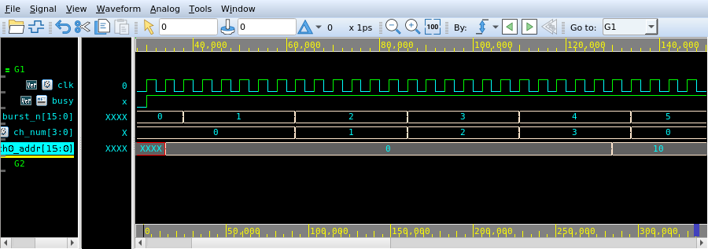

# ic-project-report

A [Claude Code](https://claude.com/claude-code) skill for writing the report that
goes around a Verilog project: what the architecture is, what the simulation
proves, and where every measured number came from.

The part worth stealing even if you never use the skill: **waveform figures are
exported by script, not screenshotted.** Verdi is a GUI tool, but it takes a Tcl
script and it will run against a virtual display, so a figure can be regenerated
a month later and come out identical.

<p align="center">
  
</p>

<p align="center"><sub>Produced by <code>example/run.sh</code>, which simulates the
throwaway design in this repo and exports this figure. Nothing was clicked.</sub></p>

That figure is the whole idea. `burst_n` counts up, `ch_num` walks 0→3 and wraps,
and `ch0_addr` steps from 0 to 0x10 *exactly* when the walk comes back round.
The placement rule is not described, it is visible, and a reader can check it
cell by cell.

## Install

```sh
git clone https://github.com/charlesHYC/ic-project-report ~/.claude/skills/ic-project-report
```

Then in Claude Code:

```
/ic-project-report <your project>
```

## Try the example

Self-contained: a 68-line round-robin writer, a testbench, and three figures.

```sh
cd example
EDA_ENV=/path/to/your/eda/setup ./run.sh
```

That compiles, simulates, dumps an FSDB and exports `sample/*.png`. If it works
on this, it will work on your design.

## Exporting figures from your own FSDB

```sh
scripts/verdi_capture.sh <fsdb> <top> <figures-file> [outdir]
```

One figure per line — a name, a time window, and the signals:

```
# name        t_start   t_end     signals (paths relative to the top)
launch          50000    132000   clk go busy arvalid arready ch0_araddr
data           152000    260000   clk ch0_rvalid ch0_rlast ch0_rdata
done          4180000   4262000   clk busy done cycles
```

## Four ways this fails silently

Every one of these produces a plausible-looking result rather than an error,
which is why they are worth writing down.

**The FSDB time unit is usually ps, not ns.** `wvZoom` takes that unit. Passing
nanosecond numbers zooms to a window before anything happens and captures a
picture of flat zeroes. Check with `wvGetFileTimeUnit`.

**`wvCreateWindow` makes a new window every call, but `$_nWave2` keeps pointing
at the first one.** A window per figure captures empty panes. Open one window and
clear it between figures.

**`-nogui` does not render the waveform pane.** A capture taken under it is blank.
Run the real GUI against your own Xvfb instead.

**Verdi does not stop on an unknown command.** It prints one line and carries on,
so a typo just means a missing figure. (The export command is `wvCapture`;
`wvExportBitMap` does not exist.) The script treats that line as fatal.

## Making a waveform readable

A flattened AXI bus shows up as one very wide hex value that nobody can read. Add
named views in the **testbench** — they drive nothing, they exist to be looked at:

```verilog
wire [AW-1:0] ch0_araddr = araddr[0*AW +: AW];
wire [47:0]   tx_dst_mac = tx_tdata[47:0];
```

And make a status indicator **hold** its last value rather than returning to idle.
A "which channel was last written" signal that drops to −1 between bursts is a row
of spikes separated by `0xFFFFFFFF`; one that holds is a staircase you can read.
That single change is what makes the figure above legible.

## What's in here

| Path | |
|---|---|
| `SKILL.md` | the report structure, the traps, and the measurement discipline |
| `scripts/verdi_capture.sh` | FSDB + figures file → PNGs |
| `scripts/embed.py` | fold the CSS and images into one self-contained HTML |
| `assets/report.css` | black-and-white academic style, screen-first, prints cleanly |
| `example/` | a runnable demo: design, testbench, figures file, and its output |

## On the numbers in a report

The section of `SKILL.md` that gets used most is the one about measurement, so a
summary here:

- **Say what each measurement point actually measures.** A counter inside the
  design, a host-side timer and a receiver's own counters are three different
  quantities. Mixing them is how a report ends up claiming more than it can show.
- **If the testbench randomises anything, report a mean and a spread**, from a
  seed sweep, and say plainly that the spread belongs to the testbench rather
  than to the design.
- **When simulation and hardware disagree, say which way and why.** Often one
  path is pessimistic in simulation and another is optimistic, and the optimistic
  one is really telling you the hardware has hit an external limit.
- **Recompute every derived number before shipping.** Write a script for it.

## License

MIT — see [LICENSE](LICENSE).
